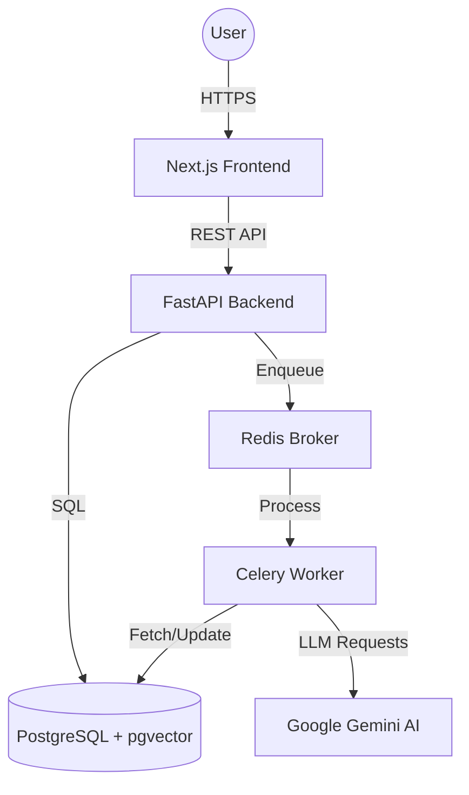

# Technical Design Document: AI Job Application Copilot 🧠

This document outlines the architectural decisions, data modeling, and engineering patterns implemented in the AI Job Application Copilot. This project was built to demonstrate proficiency in full-stack development, asynchronous systems, and LLM integration.

---

## System Architecture

The application follows a distributed microservices-inspired architecture, unified by Docker orchestration.

### Key Components

- **Frontend (Next.js 15):** High-performance React framework using the App Router. Features a standalone production build for minimal Docker image size.
- **Backend (FastAPI):** High-concurrency Python API utilizing asynchronous request handling (`async/await`) and Pydantic for strict data validation.
- **Background Worker (Celery):** Offloads long-running AI tasks (PDF parsing, LLM generation, embedding calculation) from the request-response cycle to ensure high UI responsiveness.
- **Vector Database (pgvector):** Extends PostgreSQL to store and query high-dimensional embeddings for semantic job-to-resume matching.

---

## Data Modeling

The schema is designed for relational integrity with a focus on audit trails and semantic metadata.

### Core Entities

- **User:** Authentication and identity (JWT-based).
- **Resume:** Stores parsed text and vector embeddings of user experience.
- **Job:** Stores industry-standard job descriptions and their corresponding embeddings.
- **Application:** The central pivot table tracking the lifecycle (Kanban status) of a job-resume pair, including generated cover letters and interview prep.

### Semantic Search Pattern

We implement **Retrieval-Augmented Generation (RAG)** principles. Resumes and Jobs are converted into 768-dimensional vectors using Gemini's `text-embedding-004` model. These are stored in `pgvector` columns using HNSW indexing for O(log n) similarity search.

---

## AI & LLM Integration

The "Copilot" functionality is powered by several distinct AI pipelines:

1. **Information Extraction:** During resume upload, LLMs are used to extract structured data from unstructured PDF text.
2. **Semantic Matching:** Calculate cosine similarity between resume and job vectors to provide a "Compatibility Score".
3. **Contextual Generation:**
   - **Cover Letters:** Injects base resume content and job requirements into a strictly defined prompt to minimize hallucinations.
   - **Interview Prep:** Analyzes the job description to generate targeted technical and behavioral questions tailored specifically to the user's background.

---

## Engineering Challenges & Solutions

### 1. The "Another Operation in Process" Error

**Problem:** In high-concurrency environments with Celery's prefork model, SQLAlchemy connections were shared across forks, leading to database lock-ups.

**Solution:** Implemented `NullPool` for the async engine and optimized the database session lifecycle to ensure 100% thread/process safety.

### 2. UI Perception & Observability

**Problem:** Long-running AI tasks (3-5 seconds) can make a UI feel sluggish.

**Solution:**

- **Task Polling:** Implemented a backend polling system with `task_id` tracking.
- **Loading Skeletons:** Designed animated UI skeletons that mimic content shape, significantly improving **Perceived Performance**.
- **Structured Middleware:** Built custom FastAPI middleware to log request latency and status codes, providing production-grade observability.

---

## Security & Deployment

- **Containerization:** Multi-stage Docker builds to reduce footprint and separate build-time dependencies from runtime.
- **CI/CD:** Automated GitHub Actions pipeline to enforce linting and build sanity on every push.
- **CORS Management:** Dynamic origin validation based on environment-specific trust lists.

---

## Vision

This project serves as a proof-of-concept for how specialized LLM agents can augment the modern career hunt, transforming a chaotic search into a data-driven pipeline.
